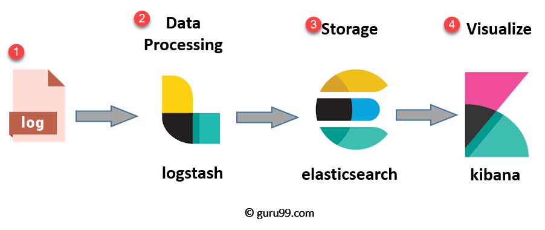

# application-observability
## Introduction
As I've been tasked with exploring solutions for application observability, I've invested time in researching the concept and conducting several POC. I aim to document all the insights gained during this process, with the hope that it proves beneficial to others.

## Observability

  

###### Source Picture: https://peter.bourgon.org/blog/2017/02/21/metrics-tracing-and-logging.html
###### [Observability 3 ways: Logging, Metrics & Tracing](https://www.dotconferences.com/2017/04/adrian-cole-observability-3-ways-logging-metrics-tracing)

In the realm of observability theory, three fundamental components exist: `Logging`, `Metrics`, and `Tracing`, collectively known as the `Three Pillars of Observability`. An application that incorporates all three pillars empowers us to comprehensively assess the health of our system. This holistic approach enables us to anticipate and safeguard against potential issues in the future. Moreover, in the event of an issue, it facilitates efficient investigation and swift resolution of problems.

The reason that we need to gather 3 components, because each one it can only provide to some aspect of applicationIn for example if we keep only logging, It quite good for debug or investigate per txn. but still lack of overview of system. Moreover, each components also require tools or framework in difference to gather info from application as well. So I'm going to describe in detail in next section below.

## Logging 
Logging is the process of recording events, actions, or data points that occur in a system, application, or software. These recorded events are typically stored in log files, and they provide a detailed history of what has happened within the system. Logging is a fundamental practice in software development and system administration, offering several benefits.

#### Highlights of Logging 
>1. Implementation is straightforward, supporting both string and JSON formats.
>2. Various libraries and frameworks offer robust log-writing capabilities.
>3. Facilitates issue investigation at a granular code level.
>4. Enables the viewing of errors and exceptions related to specific issues.

#### Drawback of Logging 
>1. Data Volume: Large logs pose challenges in storage, retrieval, and analysis, impacting performance and costs.
>2. Performance Impact: Logging can introduce performance overhead, affecting application responsiveness.
>3. Information Overload: Excessive detail in logs can lead to difficulty in identifying crucial information.

#### Common tools for logging

  

###### Source Picture: https://www.guru99.com/elk-stack-tutorial.html

The ELK Stack, comprised of Elasticsearch, Logstash, and Kibana, is a popular and powerful combination of tools for log management and analysis. Here's an overview of each component and how they work together:

`Elasticsearch`:
Elasticsearch is a distributed, RESTful search and analytics engine.\
Role: It serves as the backbone for storing and indexing log data in real-time. Elasticsearch allows for efficient searching, querying, and analysis of large volumes of logs.

`Logstash`:
Logstash is an open-source data processing pipeline.\
Role: Logstash ingests and processes log data from various sources, transforming it into a standardized format. It facilitates the collection, parsing, and enrichment of logs before forwarding them to Elasticsearch.

`Kibana`:
Kibana is a data visualization and exploration tool.\
Role: Kibana provides a user-friendly interface for visualizing and exploring log data stored in Elasticsearch. Users can create custom dashboards, perform ad-hoc queries, and generate visualizations such as charts, graphs, and maps.

### POC project [spring-boot-logstash-aop](https://github.com/santipabWannakiri/spring-boot-logstash-aop)

## Metrics
Metrics are statistical measurements collected over specific time intervals, often organized into time series data. They provide insights into various aspects of a system or application's performance. For instance:

`System Metrics`: CPU Usage,RAM Usage, Network Throughput etc.\
`Application Metrics`: Request Count, Error Rate, Latency, Average Response Time etc.

These metrics, collected over time, enable comprehensive monitoring and analysis, allowing for the identification of trends, anomalies, and areas for improvement in both system and application domains. By understanding these metrics, teams can proactively optimize performance, troubleshoot issues, and enhance the overall reliability of the system.

#### Highlights of Metrics 
>1. The majority of instrumentation tools available on the market facilitate metric retrieval without the need for code modifications.
>2. Conserves disk space and has a minimal impact on performance compared to logging.
>3. Gain a holistic view of your application's health and performance.
>4. Metrics are time series data; they reveal future trends, enhancing the ability for strategic planning and improved resource allocation.

#### Drawback of Metrics 
>1. Metrics collection relies on instrumenting applications or systems with the necessary monitoring tools. This dependency may introduce additional overhead and potential points of failure.
>2. In pull-based systems where metrics are collected at specific intervals, there is a possibility that the system might miss capturing outliers or sudden variations in the data.
>3. Analyzing a large volume of metrics data, especially from diverse sources, can introduce complexity in interpretation. 
>4. Metrics may lack detailed information compared to logging, limiting the depth of insights available for thorough analysis and investigation.

#### Tools for Metrics

  

###### Source Picture: https://www.metricfire.com/blog/prometheus-vs-zabbix

Unlike logging, where ELK readily comes to mind, metrics offer a plethora of tool choices. Notably, Prometheus and Zabbix are frequently recommended for centralized metric implementations.

`Prometheus` is an open-source monitoring and alerting toolkit designed for dynamic, cloud-native environments. It adopts a pull-based model, scraping metrics from instrumented targets. Utilizing PromQL for querying time series data, it features built-in alerting with configurable thresholds, strong Kubernetes integration, and supports various exporters for third-party systems.

`Zabbix` is also an open-source monitoring solution renowned for its network and application monitoring capabilities. It employs a relational database for storing metrics data and offers both agent-based and agentless monitoring options. Zabbix provides flexible alerting rules, supports SQL-based data queries, and integrates well with a wide range of devices and systems, including SNMP devices. It is known for its versatility and scalability, making it suitable for medium to large environments.

Choose Prometheus for dynamic, cloud-native environments with strong Kubernetes integration and a pull-based model. Opt for Zabbix if you need versatility, support for both agent-based and agentless monitoring, and scalability for various environments, including traditional infrastructure. Consider specific use cases, monitoring goals, and infrastructure preferences when making a decision.

### POC project

## Tracing
Tracing involves tracking the journey of requests as they traverse various services or components within an application. The primary focus is on measuring the time spent at each component, providing an end-to-end overview. This approach is particularly valuable in microservices architectures to identify delays or bottlenecks in the application, enabling investigation and optimization. 

The principle of tracing typically involves the generation of a unique identifier (often called a trace or correlation ID) when a request enters the system. This unique ID is then propagated through the different components or services that handle the request. As the request flows through the system, each component adds information to the trace, such as the time it took to process the request or any other relevant data.

By using a unique ID that is passed along with the request, it becomes possible to link together all the individual traces generated by each component and create a complete trace of the entire request's journey through the system. This helps in understanding the flow, identifying performance bottlenecks, and troubleshooting issues in a distributed and often complex microservices architecture.

#### Highlights of Tracing

#### Drawback of Tracing 

#### Tools for Tracing

### POC project
